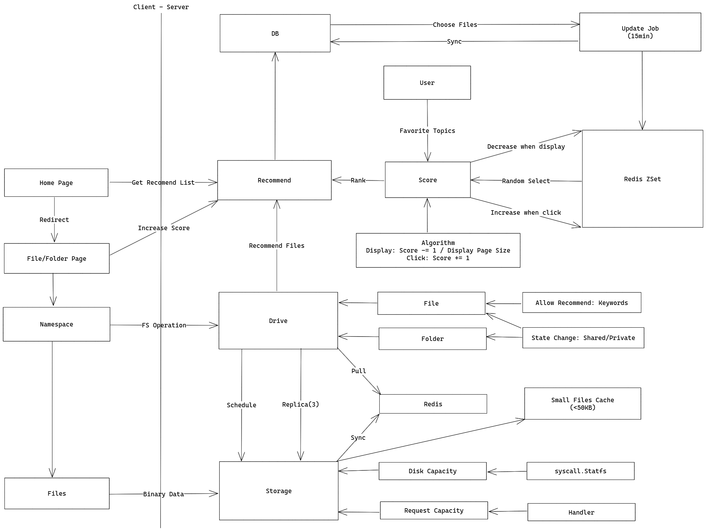

# 分布式云盘

提供Google Drive的基本功能, 并做一些扩展.

## 功能

* ✔️文件和目录管理
* ✔️分享
* ✔️回收站
* ✔️容量限制
* ❌小文件随机读写
* ❌管理员接口
* ❌推荐系统

## 架构图



## 权衡

### 路径存储

#### 方案一: 深度 + 完整路径

```text
0/
1/home
2/home/dir
3/home/dir/file
```

优点: 便于获取路径.

> [Baidu File System Design](https://github.com/baidu/bfs/blob/master/docs/cn/design.md#namespace)

#### 方案二: 文件名 + 父级指针

优点: 便于操作目录.

## 服务

规定: 8080端口接受客户端HTTP请求，8081端口接受服务间RPC请求.

| 服务      | 功能               |
|---------|------------------|
| User    | 用户管理             |
| Drive   | 命名空间、容量管理，调度存储节点 |
| Storage | 存储节点             |
| Mysql   | 数据库              |
| Redis   | 缓存、消息队列、同步存储节点状态 |

## 部署

服务编译: 容器外编译, 请确保目标平台为Linux.

服务部署: Docker Compose.

```shell
$ ./build.sh
```

## 项目结构

```text
/internal
  /common:
    /auth: authentication
    /decorator: handler decorators
  /pkg:
    /events: shared event definition
    /types: shared request and response definition
  /service:
    /adapters: interface implementation
    /domain: domain object
    /main: main function
    /ports: http and rpc handler
    /remote: remote service interface
    /repository: repository interface
    /service: application service
    /usecases: use case and event handler
```

## 数据一致性

兜底措施: 增加定时任务, 每过一段时间查询是否有存储节点有相应的数据.

## 可用性

副本：保证一份文件至少存储在3个节点上.

## 扩展性

节点扩展：存储节点向Redis注册并同步状态.

## 性能

存储节点：对小文件进行缓存.
